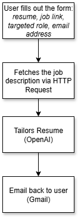

# resume-refiner-n8n
An AI Agent built in n8n that tailors a user-submitted resume to a job posting and emails structured feedback back to the user

# Overview
The Resume Refiner AI Agent helps job seekers tailor their resume to specific job postings. Built in n8n, this workflow takes input from a form (resume, job posting link, targeted role, and email address), fetches the job description, analyzes the resume with OpenAI, and emails back structured feedback.  

The feedback includes a match overview, strengths, areas for improvement, and formatting tips.

# AI Agent Flow Diagram

Here’s the workflow structure for the Resume Refiner AI Agent:

# Approach
I built this agent using a simple n8n form that collected four inputs:
- Resume (file upload)  
- Job Posting Link  
- Target Role  
- Email Address  

The workflow runs like this:
1. The form submission trigger captures the inputs.  
2. The HTTP Request node uses the job posting link to fetch the job description.  
3. The OpenAI node compares the resume against the job posting and returns feedback in JSON format.  
4. The Gmail node emails the structured feedback back to the user.

# What challenges did you face in parsing, formatting, or integrating?

One of the biggest problems was that my inputs weren’t being pulled correctly. At first, I only had "Link to the Job Posting" in my expression, so the job description wasn’t actually coming through. Because of that, the AI started hallucinating random roles instead of analyzing the real posting.  

The same issue happened with the resume. It wasn’t being passed in, so the AI gave very generic feedback. Once I updated my expression to use the full form reference:  

{{ $('On form submission').item.json['Link to the Job Posting'] }}

and dropped the resume into the defined command, the agent finally started using the real inputs and giving relevant feedback.

Formatting was another challenge. I once forgot a closing 
 tag in the Gmail node body, which made the output email come through blank. Another issue was keeping my JSON output consistent. If my prompt didn’t match the schema exactly, n8n couldn’t parse it, and I’d get a blank email.

Integration also caused problems. The output parser disconnected at one point, which I didn’t notice right away, and that caused the results to come back empty. On top of that, I had to test the Gmail node several times to get the subject and body right so that the variables pulled correctly. Prompt engineering took a lot of trial and error before the AI would follow the exact structure I wanted.

# How did you ensure that the AI returned JSON reliably?

To keep the output structured, I followed Kevin’s example and gave the AI a strict schema:

{
  "match_overview": "string",
  "aligned_sections": ["string"],
  "improvements": ["string"],
  "formatting": ["string"]
}
Also, most of the time, n8n helped me stay consistent because it flagged errors in red when the JSON didn’t parse correctly. I used the Execute Step button often to test outputs after I made changes.

# Troubleshooting

Issues I Encountered and How I Solved Them

-- Inputs not being pulled

Fix: Updated the expressions to reference the form submission properly. This stopped the AI from hallucinating unrelated roles.

-- Blank emails

Fix: Added the missing 
 tag in my HTML formatting.

-- Output parser disconnected

Fix: Reconnected it and confirmed the workflow executed end-to-end.

-- Prompt and schema mismatch

Fix: Made sure the schema in my prompt always matched the JSON structure expected by n8n.

-- AI not following instructions

Fix: Iterated and tested the prompt several times until it produced reliable results.

 # Future Improvements

1. Add a match percentage or grade rating (A/B/C) to show how closely the resume matches the job description.

2. Instead of only giving tips, have the AI rewrite weak bullet points for the user.

3. Add keyword coverage analysis so users can see which keywords are included versus missing.

4. Provide a fallback option for users to paste the job description if the HTTP Request fails.

6. Provide a fallback option for users to paste the job description if the HTTP Request fails.
